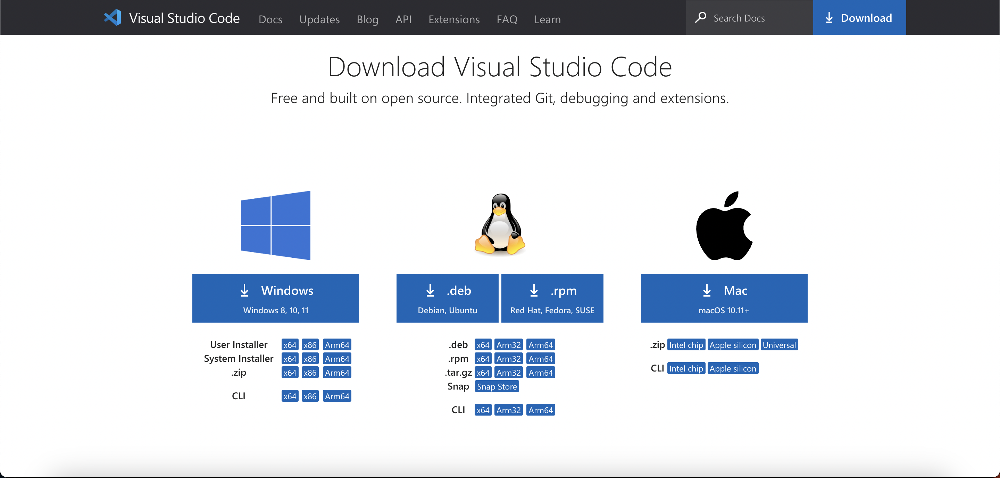

# Lab Report 1

## Step 1: Installing VSCode

Head to [this](https://code.visualstudio.com/Download) website and download the version of Visual Studio Code that fits your operating system. 

If your screen looks like this you are on the right page. 

Follow the given instructions to install it on your computer. After installing VSCode, open the application. Your screen should look as follows. 

## Step 2: Remotely Connecting

Once VSCode is open and running, open a new terminal by going to the task bar and clicking **Terminal** -> **New Terminal**. Once your terminal is open in VSCode, type in the following command `ssh cs15lsp23zz@ieng6.ucsd.edu` replacing `zz` with your course-specific account.
If this is your first time logging in, you're likely to encounter the following message:
```
The authenticity of host 'ieng6.ucsd.edu (128.54.70.227)' can't be established.
RSA key fingerprint is SHA256:ksruYwhnYH+sySHnHAtLUHngrPEyZTDl/1x99wUQcec.
Are you sure you want to continue connecting (yes/no/[fingerprint])? 
```
Type in yes and enter your password. Your terminal shoud look as follows [Image](loggedin.png)

## Step 3: Trying Some Commands
