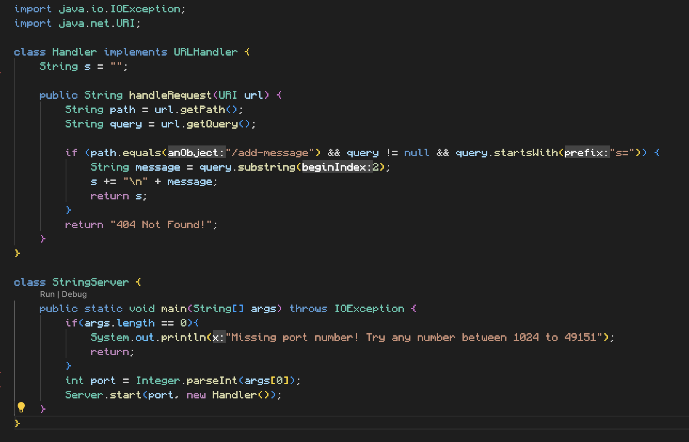
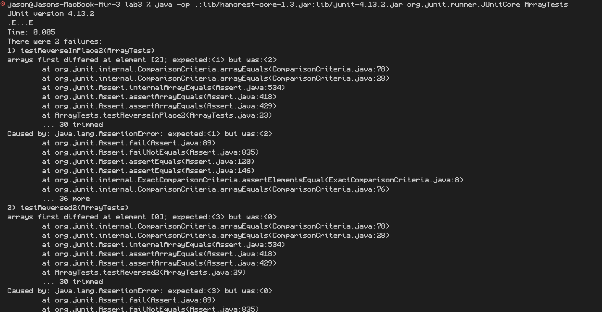

# Lab Report 2

## Part 1



The methods that is called is handleRequest(). The relevant argument is the URI "add-messages?s=Hello". The query s has the parameter "Hello". The relevant field is s in the Handler class which is currently empty. The value of s in the class Handler would change from an empty String to "Hello". 


The methods that is called is handleRequest(). The relevant argument is the URI "add-messages?s=How%20are%20you". The query s has the parameter "How are you". The relevant field is s in the handler class which is currently set to "Hello\n". The value of s in the class Handler would change from "Hello\n" to ""Hello\nHow are you". 

## Part 2
Failure Inducing Input:
```
@Test
  public void testReverseInPlace2() {
    int input1 = {0,1,2,3};
    ArrayExamples.reverseInPlace(input1);
    assertEquals(new int[] {3,2,1,0}, input1);
  }
```

Input that doesn't fail:
```
@Test 
	public void testReverseInPlace() {
    int[] input1 = { 3 };
    ArrayExamples.reverseInPlace(input1);
    assertArrayEquals(new int[]{ 3 }, input1);
  }
```

Symptom as the output:


The bug, before and after:
```
static void reverseInPlace(int[] arr) {
    for(int i = 0; i < arr.length; i += 1) {
      arr[i] = arr[arr.length - i - 1];
    }
  }
```
```
static void reverseInPlace(int[] arr) {
    for(int i = 0; i < arr.length / 2; i += 1) {
      int index = arr[i];
      arr[i] = arr[arr.length - i - 1];
      arr[arr.length - i - 1] = index;
    }
  }
```
By only iterating through half of the array's length, the elements from both ends of the array are swapped until it gets to the middle. In the before code, it iterates through the entire length of the array which causes the list to be the same as before.

## Part 3
Prior to this class, I had no knowledge about github or anything to do with a web server. After Lab 2, I now have a basic grasp of how github works and also know how to create a web server from stratch. 
