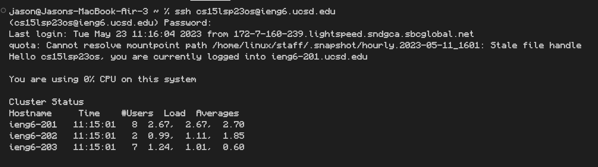
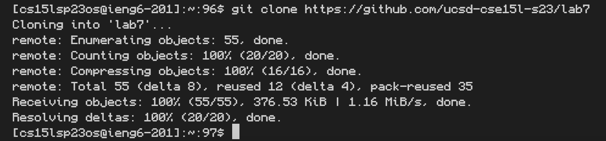
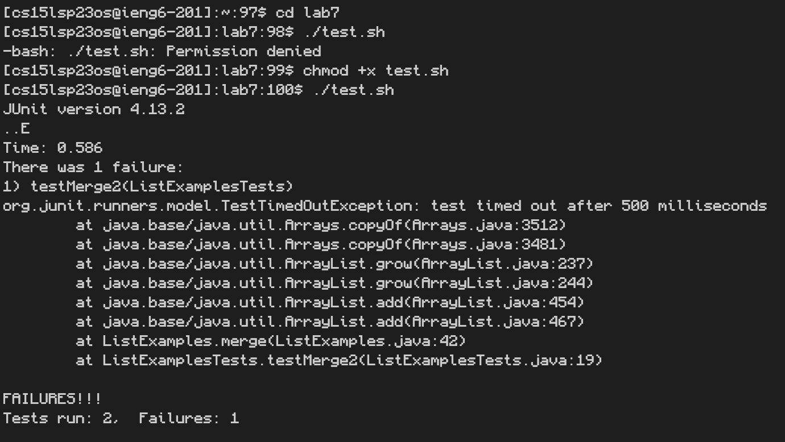
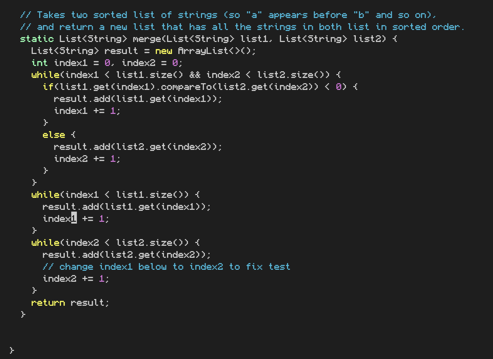
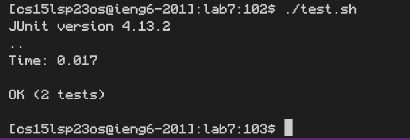
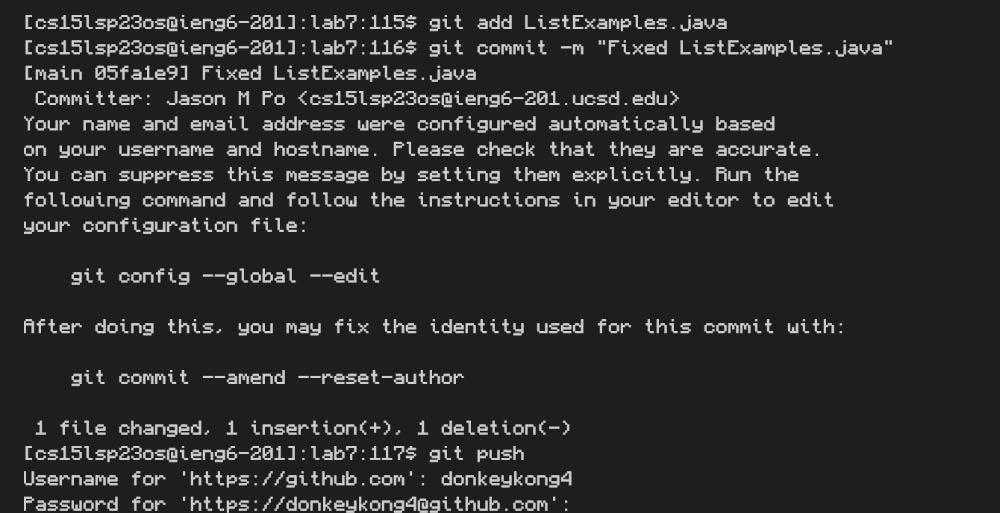

## Lab Report 4

# Step 4

`ssh <space> cse15lsp23os@ieng6.ucsd.edu <enter>`

# Step 5

`git <space> clone <space> https://github.com/ucsd-cse15l-s23/lab7 <enter>`

# Step 6

```
cd <space> lab7 <enter>
chmod <space> +x <space> test.sh <enter>
./test.sh <enter>
```

# Step 7

```
vim <space> ListExamples.java <enter>
jjjjjjkkkkkkkr2:wq <enter>
```
# Step 8

`./test.sh <enter>`

# Step 9

```
git <space> add <space> ListExamples.java <enter>
git <space> -m <space> "Fixed <space> ListExamples.java" <enter>
git <space> push <enter>
```
