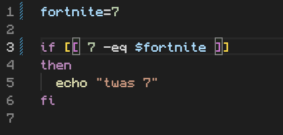
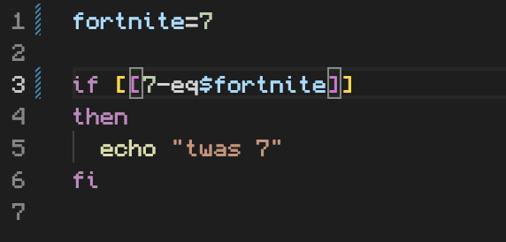

## Lab Report 5

# Part 1

**What environment are you using (computer, operating system, web browser, terminal/editor, and so on)?**

macOS, Google Chrome, VSCode terminal.

**Detail the symptom you're seeing. Be specific; include both what you're seeing and what you expected to see instead. Screenshots are great, copy-pasted terminal output is also great. Avoid saying “it doesn't work”.**

The symptom that I'm seeing is that when I try to run the file test.sh, it says that the command is not found.

**Detail the failure-inducing input and context. That might mean any or all of the command you're running, a test case, command-line arguments, working directory, even the last few commands you ran. Do your best to provide as much context as you can.**

The failure inducing input is when I try to run the file test.sh, the terminal outputs that the command cannot be found.

**TA Response**

Dear Student, thank you for your inquiry. Have you reviewed the conditional expression in the code? Pay attention to the spacing, is there anything that stands out to you?

The bug is that there is there is not an adequate amount of spaces in the conditional line resulting in a syntax error.
The directory is example while the file is test.sh.

Before: 

The line ran to trigger the bug: `bash test.sh`

Fix: Make sure that there are spaces within the brackets on the if statement or else a syntax error will occur and the file won't be properly read.

# Part 2

Throughout the second half of this course, I learned a great deal of new information. Specifically, I learned how to use Vim editor. I found the tutorial for that very interesting and knowing how to use it makes it a lot easier when trying to edit files on a web server. 

